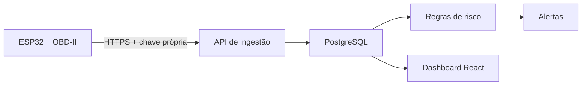

# Zerith API — MVP ENPE

Backend do MVP da Zerith integrado ao dashboard React e preparado para receber telemetria de um ESP32.

## Executar a demonstração

Crie um arquivo `.env` na raiz (ele não deve ser versionado):

```dotenv
DB_PASSWORD=<defina-uma-senha-local>
JWT_SECRET=<gere-uma-chave-aleatoria-com-32-ou-mais-caracteres>
ZERITH_DEMO_PASSWORD=<defina-a-senha-de-login-da-apresentacao>
ZERITH_DEVICE_KEY=<defina-a-chave-do-esp32>
```

Depois execute:

```bash
docker compose up --build
npm install
npm run dev
```

Abra `http://localhost:8080/zehit/` e entre com `italo@zerith.tech` e a senha definida em `ZERITH_DEMO_PASSWORD`.

## Fluxo do MVP



## Endpoints

| Método | Endpoint | Uso |
| --- | --- | --- |
| POST | `/api/v1/auth/login` | Login e emissão do JWT |
| POST | `/api/v1/ingest/telemetry` | Recepção idempotente do ESP32 |
| GET | `/api/v1/dashboard/summary` | Indicadores do painel |
| GET | `/api/v1/vehicles` | Frota isolada por empresa |
| GET | `/api/v1/vehicles/{code}/telemetry` | Histórico de sensores |
| GET | `/api/v1/alerts` | Alertas da empresa |
| PATCH | `/api/v1/alerts/{id}/status` | Tratamento de alertas |
| GET | `/actuator/health` | Saúde da API |

## Testar sem o ESP32

Use uma sequência inédita e a mesma chave definida em `ZERITH_DEVICE_KEY`:

```bash
curl -X POST http://localhost:8081/api/v1/ingest/telemetry   -H "Content-Type: application/json"   -H "X-Device-Key: <sua-chave-local>"   -d '{"deviceId":"ZERITH-ESP32-001","sequence":1,"capturedAt":"2026-09-14T14:00:00-03:00","engineTemperatureC":108.5,"batteryVoltageV":11.4,"vibrationG":5.2,"rpm":2800,"speedKmh":62,"odometerKm":25438.4,"dtcCodes":["P0217"]}'
```

Uma leitura crítica atualiza o veículo e gera alerta. Reenviar a mesma sequência retorna `duplicate: true`.

## Decisões

- Monólito modular e multiempresa por `tenant_id`.
- JWT para o painel; chave SHA-256 independente por dispositivo.
- PostgreSQL e Flyway.
- REST no MVP para reduzir risco da apresentação; MQTT entra após a validação de campo.
- Firmware com sensores simulados agora; o adaptador OBD-II manterá o mesmo contrato.
